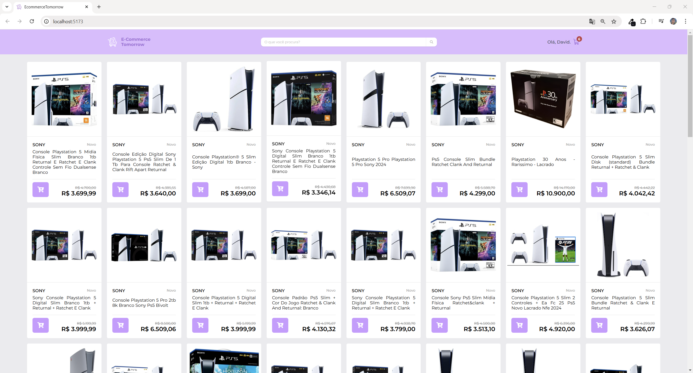
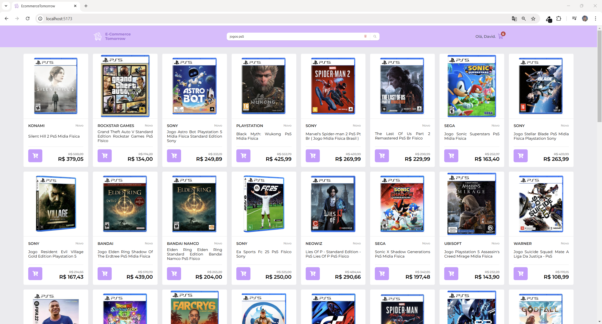
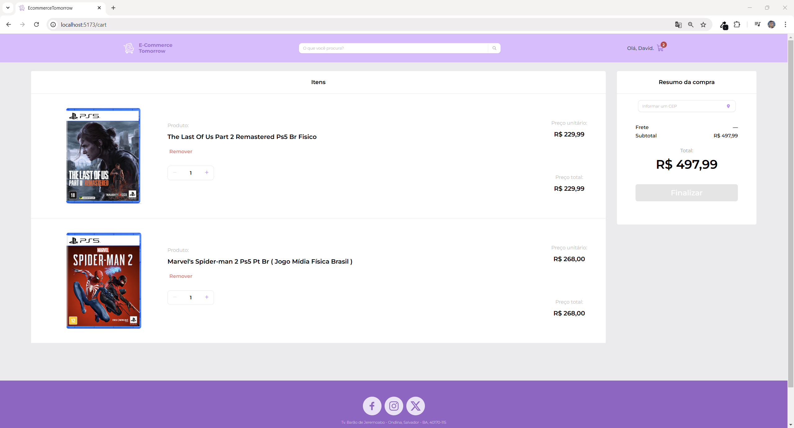
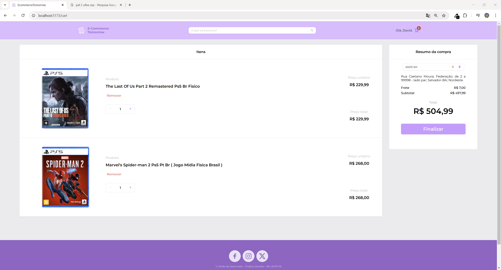

## 🛒 EcommerceTomorrow ️🛒

EcommerceTomorrow é uma aplicação de e-commerce funcional desenvolvida em **[React](https://react.dev/)** e **[Vite](https://vitejs.dev/)** com JavaScript, utilizando uma série de tecnologias para oferecer uma experiência intuitiva e eficiente. O projeto integra consumo de APIs como viacep e do mercado livre, possui também gerenciamento de estado global, persistência de dados, esqueleto de carregamento e um design razoavelmente responsivo, ideal para quem deseja explorar práticas de desenvolvimento frontend.  

## 🖥️ Destaques e Funcionalidades.
- ***Navegação entre Produtos:***  
Permite que os usuários navegue entre os produtos, enquanto consome a  [API mercado livre](https://developers.mercadolivre.com.br/pt_br/guia-para-produtos) para desenvolvedores.
- ***Barra de pesquisa:***  
Usando hooks como `useContext`, `useState` e `Provider`, podemos atualizar o array de produtos exibidos na home com uma ajudinha da função `fetchProducts`.
- ***Carrinho de compras:***
Usuários podem adicionar qualquer produto da home no seu carrinho de compras, que terá seu valor incrementado no header.
- ***Consulta de CEP:***
Podemos encontrar seu endereço através do CEP, usando `fetchAddress`, com uma barra de pesquisa que incluse formata o CEP automaticamente e que só aceita caracteres numéricos graças a `handleChangeCep` e `formatCep`.
- ***Cálculo do total e frete:***
Na tela de carrinho o usuário pode acompanhar seus gastos graças a uma implementação de reduce, inclusive o valor de frete é gerado aleatoriamente através de `calculateShippingFee`. A finalização de compra só é possível se o CEP for consultado.
- ***Alterar quantidade e remoção do item no carrinho:***
O usuário pode incrementar e decrementar a quantidade um de determinado item no carrinho graças a `updateCartItemAmount`, além de remover o item completamente do seu carrinho com `removeItemFromCart` que usa um filter.
- ***Persistência dos dados:***
Utilizando `localStorage` podemos manter os itens que estão armazenados no carrinho permanentemente, que agora não desaperem ao atualizar a página nem encerrar a aplicação no terminal.
- ***Esqueleto de carregamento:***
Usando a biblioteca `react-loading-skeleton`, podemos criar componentes de carregamento, imitando outros, que podem ser exibidos enquanto funções assíncronas estão sendo executadas, por exemplo enquanto resgatamos os produtos das api.

## 🖼️ ️Algumas Screenshots. 
Veja algumas imagens das telas principais do projeto:
<p align="center">
    <details>
        <summary>Clique para mais detalhes</summary>
        
        
        
        
    </details>
  
</p>

## 🚀 Instalação e Dependências.
Siga estas etapas para configurar e executar o projeto localmente na sua própria máquina. É necessário instalar o [Node.js](https://nodejs.org/en/download/package-manager) previamente. Este projeto esta usando vite.
1. Clone o Repositório. 💻
```bash
git clone https://github.com/DavidOSilva/EcommerceTomorrow
cd EcommerceTomorrow
```

2. Instale as Dependências. 📱
```bash
npm i
```

3. Agora basta iniciar a aplicação. Por padrão o servidor estará disponível em `http://localhost:5173/`.
```bash
npm run dev
```

###  🗂️ Estrutura de Diretórios ️
O diretório `src` contém todo o código-fonte da aplicação e está organizado da seguinte forma:
- **`api/`**: Serviços e funções para comunicação com APIs externas.
- **`App.jsx`**: Componente principal do React, responsável por organizar e renderizar o aplicativo.
- **`assets/`**: Arquivos estáticos, como imagens, ícones e fontes.
- **`components/`**: Componentes reutilizáveis do React.
- **`contexts/`**: Contextos do React para gerenciamento de estado global.
- **`index.css`**: Estilos globais aplicados à aplicação.
- **`main.jsx`**: Ponto de entrada do aplicativo React, onde o React DOM renderiza o aplicativo.
- **`pages/`**: Componentes React que representam páginas específicas da aplicação.
- **`utils/`**: Funções utilitárias e auxiliares para uso em todo o projeto.

## 📬 Contato
David Oliveira Silva - @DavidOSilva - davidoliveirasilvaa@gmail.com
